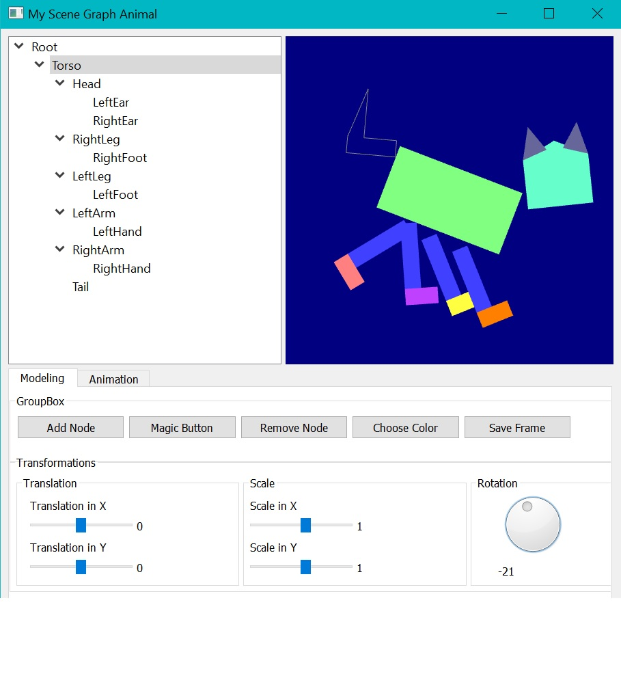

# Animated-Scene-Graph-UI

Scene Graph Guide: This application has the abilities to redesign an animal in any way using the x and y translation sliders, the x and y scaling sliders, the rotation dial and the color chooser. The user can create and remove nodes during redesigning. A magic button can be pressed which resets the scene graph and redraws the default animal.

Animation Guide: This application has the added abilities to animate a created animal. By changing the transformations of the animal, there is a save button in the modeling tab and an animate in the animation tab that saves the current scene graph for any set animation. By going to the animation tab, you can hit the play button to play the animation. There is a backward and foward button to go through the animation step by step. 

